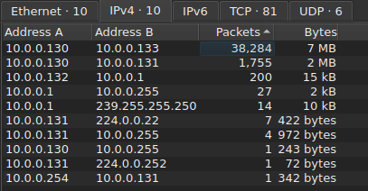
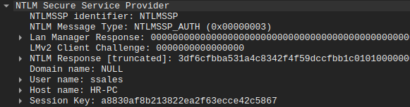
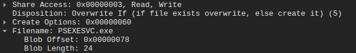
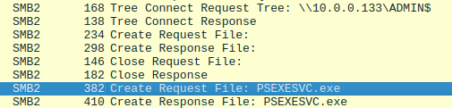
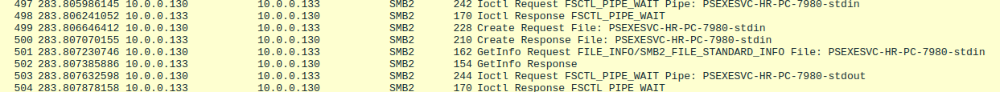
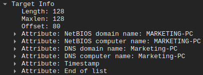

# PsExec Hunt Lab

| Propiedad             | Detalle                                |
| :-------------------- | :------------------------------------- |
| **Plataforma** | CyberDefenders                         |
| **Categoría** | Network Forensics                      |
| **Dificultad** | Fácil                                  |
| **Estado** | Completado                              |
| **Proyecto Completo** | [matircode.dev](https://matircode.dev) |

---

## 1. Resumen Ejecutivo

### Antecedentes e Inicialización
La presente investigación forense se inició tras la activación de una alerta en el Sistema de Detección de Intrusos (IDS), la cual identificó actividad sospechosa de movimiento lateral mediante el uso de la herramienta PsExec. Esta firma de red es un indicador de alto riesgo que sugiere un posible acceso no autorizado y desplazamiento malicioso entre activos internos de la infraestructura.

### Alcance de la Investigación
El análisis se centra exclusivamente en el examen del archivo de captura de tráfico de red (PCAP) provisto, con los siguientes objetivos técnico-operativos:
1. Identificar el punto de entrada inicial (vector de acceso) utilizado por el actor de amenazas.
2. Determinar cuáles máquinas y segmentos de red fueron el objetivo del movimiento lateral.
3. Evaluar la extensión y el impacto real del compromiso dentro del entorno afectado.
4. Extraer indicadores de compromiso (IoCs) críticos que revelen las tácticas y objetivos del adversario.

### Conclusiones Generales
El análisis forense del tráfico de red confirma un compromiso interno persistente caracterizado por movimiento lateral mediante técnicas de Living-off-the-Land (LotL), abusando de la cuenta legítima `ssales`. El actor de amenazas logró establecer control sobre el host `sales-pc` (`10.0.0.133`) mediante la instalación remota del servicio legítimo abusado `PSEXESVC.exe`. No se identificaron vectores de exfiltración masiva de datos hacia el exterior en los flujos analizados; sin embargo, se confirmaron acciones de reconocimiento activo y tentativas de autenticación dirigidas hacia el activo `marketing-pc`, validando la expansión del radio de impacto del adversario dentro del perímetro interno.

---

## 2. Línea de Tiempo del Incidente (Timeline)
Lista cronológica detallada de las acciones del actor de amenazas, deducidas a través del análisis del tráfico de red y los artefactos disponibles.

| Marca de Tiempo (UTC) | Evento / Acción del Atacante                                                                                   | Artefacto / Fuente de Log / Filtro                                                            |
| :-------------------- | :------------------------------------------------------------------------------------------------------------- | :-------------------------------------------------------------------------------------------- |
| 2023-10-11 07:42:08   | Detección de actividad anómala masiva y establecimiento del vector atacante.                                   | Dirección IP: `10.0.0.130` / Wireshark: Statistics > Conversations (IPv4)                     |
| 2023-10-11 07:42:08   | Intento de movimiento lateral y autenticación exitosa mediante la cuenta comprometida `ssales`.                | Host destino: `sales-pc` (`10.0.0.133`) / Protocolo: SMB2 (Session Setup Request)             |
| 2023-10-11 07:42:08   | Solicitud de creación y transferencia del binario del servicio ejecutable `PSEXESVC.exe` en el sistema remoto. | Recurso: `\\10.0.0.133\ADMIN$` / Protocolo: SMB2 (Create Request File) / Wireshark: Frame 144 |

---

## 3. Mapeo de Amenazas (MITRE ATT&CK Framework)
Correlación formal de las Tácticas, Técnicas y Procedimientos (TTPs) identificadas durante la investigación con el marco de trabajo de MITRE ATT&CK.

### Táctica: Ejecución (TA0002)
* **Técnica:** System Services: Service Execution (T1569.002)
* **Análisis Técnico:** El atacante interactuó con el Administrador de Control de Servicios (SCM) remoto del host objetivo para instalar y ejecutar de manera inmediata el binario `PSEXESVC.exe` (identificado en el Frame 144). Este comportamiento permitió al adversario el despliegue de un agente de ejecución remota capaz de correr comandos con privilegios elevados en el sistema local afectado.

### Táctica: Movimiento Lateral (TA0008)
* **Técnica:** Remote Services: SMB/Windows Admin Shares (T1021.002)
* **Análisis Técnico:** Se documentó el abuso de los recursos compartidos ocultos de administración predeterminados de Windows. El actor de amenazas utilizó credenciales válidas para realizar solicitudes explícitas de tipo `Tree Connect` hacia las rutas UNC `\\10.0.0.133\ADMIN$` y `\\10.0.0.133\IPC$`, utilizándolas como canales primarios para la transferencia del payload del servicio y la orquestación de comandos posteriores.

### Táctica: Descubrimiento (TA0007)
* **Técnica:** Remote System Discovery (T1018)
* **Análisis Técnico:** El adversario llevó a cabo actividades transversales de enumeración interna. Al interactuar con el proveedor de seguridad NTLMSSP para forzar apretones de manos adicionales, se recolectaron de forma pasiva los metadatos de identidad del sistema del segundo objetivo de la red (`marketing-pc`) a través de las estructuras decoradas de los mensajes de desafío (NTLM Challenge).

---

## 4. Indicadores de Compromiso (IoCs) Encontrados
Datos tácticos extraídos del análisis que sirven para alimentar las reglas de detección en sistemas defensivos como Firewalls, EDR o SIEM.

### Indicadores de Red (Network Artifacts)
* **Dirección IP del Actor de Amenazas:** `10.0.0.130`
* **Direcciones IP de Objetivos Internos:** `10.0.0.133` y Segmento de Pivoteo Asociado
* **Puerto de Red Identificado:** `445/TCP` (Microsoft-DS / SMB)
* **Tuberías con Nombre (Named Pipes) Activas:** `PSEXESVC-HR-PC-7980-stdin` y `PSEXESVC-HR-PC-7980-stdout`

### Indicadores de Host (Host Artifacts)
* **Cuenta de Usuario Comprometida:** `ssales`
* **Estación de Trabajo de Origen (Atacante):** `HR-PC`
* **Estación de Trabajo Comprometida (Target 1):** `sales-pc`
* **Estación de Trabajo Enumerada (Target 2):** `marketing-pc`
* **Binario del Servicio Desplegado:** `PSEXESVC.exe` (Ruta esperada del sistema: `%SystemRoot%\PSEXESVC.exe`)

---

## 5. Recomendaciones de Mitigación y Erradicación
Planes de acción correctiva y preventiva sugeridos para el equipo de ingeniería con el fin de neutralizar la amenaza persistente y robustecer la postura de seguridad.

1.  **Aislamiento y Contención de Red:** Segmentar y aislar de forma inmediata el host de origen `10.0.0.130` (`HR-PC`) y el host comprometido `10.0.0.133` (`sales-pc`) para frenar la persistencia operativa y los intentos latentes de movimiento lateral detectados hacia el entorno corporativo (`marketing-pc`).
2.  **Restricción de Recursos Compartidos Administrativos:** Implementar políticas a nivel de Directiva de Grupo (GPO) o modificar las claves de registro del sistema (`AutoShareWks`) para deshabilitar las conexiones administrativas predeterminadas (`ADMIN$`, `C$`) en estaciones de trabajo que no requieran obligatoriamente administración remota centralizada.
3.  **Endurecimiento del Tráfico SMB Interno:** Configurar reglas de Firewall de Windows (o firewalls de host basados en EDR) para denegar el tráfico entrante al puerto `445/TCP` entre estaciones de trabajo pertenecientes al mismo segmento de red, restringiendo los accesos exclusivamente desde saltos legítimos de administración autorizados (bastion hosts, servidores de dominio).
4.  **Despliegue de LAPS:** Implementar Local Administrator Password Solution (LAPS) para garantizar la rotación y aleatoriedad de contraseñas de cuentas de administración local, neutralizando vectores de propagación horizontal y ataques de Pass-the-Hash.
5.  **Monitoreo Técnico de Eventos de Host:** Establecer reglas de alerta temprana en el SIEM correlacionando la creación de nuevos servicios en el sistema (Windows Security Event ID `7045` / `4697`), filtrando con criticidad alta aquellos ejecutables alojados en la ruta raíz del sistema `%SystemRoot%` o asociados a firmas de herramientas administrativas conocidas como Sysinternals PsExec si no corresponden a ventanas de mantenimiento aprobadas.

---

## 6. Resolución del Desafío (CyberDefenders Q&A)
Sección técnica destinada a la resolución y validación de los requerimientos específicos del laboratorio, detallando el procedimiento analítico y la respectiva evidencia gráfica.

### Pregunta 1: Para rastrear eficazmente las actividades del atacante dentro de nuestra red, ¿puedes identificar la dirección IP de la máquina desde la que el atacante obtuvo acceso inicialmente?

* **Respuesta:** `10.0.0.130`
* **Metodología de Análisis:** Se procedió a realizar un triaje inicial del tráfico de red mediante el examen de las estadísticas globales de conversaciones en Wireshark (Statistics > Conversations), específicamente bajo la pestaña del protocolo IPv4. Al ordenar las conexiones de manera descendente según el volumen de interacción (Packets), se detectó un comportamiento altamente anómalo concentrado en la dirección IP `10.0.0.130` (Address A). 

    La telemetría revela que este nodo inició un intercambio masivo de datos con dos objetivos principales dentro de la infraestructura: `10.0.0.133` con un total de 38,284 paquetes transferidos (~7 MB) y `10.0.0.131` con 1,755 paquetes (~2 MB). La magnitud de estas conexiones en comparación con el resto de los flujos de la red establece a `10.0.0.130` como la zona cero o punto de origen del compromiso inicial.
  
    
  
### Pregunta 2: Para entender completamente el alcance de la brecha, ¿puedes determinar el nombre de host de la máquina al que el atacante pivotó primero?

* **Respuesta:** `sales-pc`
* **Metodología de Análisis:** Una vez aislado el tráfico del vector atacante mediante el filtro `ip.addr == 10.0.0.130`, se analizó el intento de movimiento lateral dirigido hacia la dirección IP interna `10.0.0.133` bajo el protocolo SMB2.

    Al examinar el paquete de establecimiento de sesión (Session Setup Request), la disección del `Security Blob` bajo el proveedor NTLMSSP expone el parámetro `Host: HR-PC`. Es crítico señalar que, bajo la arquitectura de autenticación NTLM, este campo identifica a la estación de trabajo de origen (el nodo atacante `10.0.0.130`). Correlacionando este flujo con la resolución de nombres en el tráfico (NBNS/DNS) para la IP de destino `10.0.0.133`, se determinó que el nombre del host objetivo al cual se realizó el pivoteo efectivo corresponde a `sales-pc`, utilizando de manera ilegítima la cuenta de usuario `ssales`.

    

### Pregunta 3: Conocer el nombre de usuario de la cuenta que el atacante usó para la autenticación nos dará una visión sobre la magnitud de la brecha. ¿Cuál es el nombre de usuario que utiliza el atacante para la autenticación?
  
* **Respuesta:** `ssales`
* **Metodología de Análisis:** La identidad de la cuenta afectada se determinó durante el análisis de los flujos de movimiento lateral dirigidos hacia el activo `sales-pc` (`10.0.0.133`) a través del protocolo SMB2.

    Al realizar la inspección detallada de la secuencia de paquetes, específicamente en la solicitud de autenticación intermedia (Session Setup Request, NTLMSSP_AUTH), la disección de las estructuras de seguridad de Windows expuso de forma explícita el identificador de cuenta de seguridad. Wireshark decodificó el parámetro dentro del campo `User: \ssales` (y el correspondiente bloque `Account: ssales` en el identificador de sesión), confirmando que el actor de amenazas poseía credenciales válidas de este usuario específico para validar su acceso en la red interna.

    

### Pregunta 4: Después de averiguar cómo se movió el atacante dentro de nuestra red, necesitamos saber qué hizo en la máquina objetivo. ¿Cómo se llama el ejecutable de servicio que el atacante configuró en el objetivo?

* **Respuesta:** `psexesvc.exe`
* **Metodología de Análisis:** Una vez establecida la sesión autenticada en el host remoto bajo el protocolo SMB2, se procedió a auditar las operaciones de archivos y recursos compartidos para identificar las herramientas de ejecución remota desplegadas por el adversario.

    La herramienta legítima de Sysinternals, PsExec, opera de manera estándar montando el recurso compartido de administración (`ADMIN$`) e instalando un servicio remoto en el sistema operativo del host objetivo. Al analizar la secuencia inmediata de comandos SMB2, se identificó el cuadro (Frame) 144, el cual registra una solicitud de tipo `Create Request File` enviada desde el vector atacante (`10.0.0.130`) hacia la máquina comprometida (`10.0.0.133`). La disección técnica del paquete revela que el nombre del binario creado y configurado en el sistema destino es de forma explícita `PSEXESVC.exe`, el cual actúa como el motor de ejecución remota para los comandos del atacante.

    

### Pregunta 5: Necesitamos saber cómo el atacante instaló el servicio en la máquina comprometida para entender las tácticas de movimiento lateral del atacante. Esto puede ayudar a identificar otros sistemas afectados. ¿Qué reparto de red utilizó PsExec para instalar el servicio en la máquina objetivo?

* **Respuesta:** `admin$`
* **Metodología de Análisis:** Para que la herramienta de ejecución remota PsExec logre interactuar con el sistema operativo de un host destino, requiere apoyarse en los recursos compartidos administrativos predeterminados de Windows. Estos recursos compartidos ocultos permiten a usuarios con privilegios elevados gestionar el sistema de archivos a través de la red.

    Al auditar la secuencia de paquetes en Wireshark previa a la instalación del binario malicioso, se identificó una solicitud de conexión a nivel de árbol (Tree Connect Request) dirigida explícitamente hacia la ruta UNC `\\10.0.0.133\ADMIN$`, tal como queda registrado en la telemetría de red expuesta. El uso de este recurso compartido específico (`ADMIN$`), que apunta directamente al directorio raíz del sistema operativo (habitualmente `C:\Windows`), fue el vector necesario para que el proceso posterior de escritura del archivo `PSEXESVC.exe` tuviera éxito, validando de este modo la resolución correcta.

    

### Pregunta 6: Debemos identificar la cuota de red utilizada para comunicarse entre ambas máquinas. ¿Qué cuota de red usaba PsExec para la comunicación?

* **Respuesta:** `ipc$`
* **Metodología de Análisis:** Tras la instalación del servicio en el host remoto, la herramienta PsExec requiere establecer un canal bidireccional y persistente que le permita enviar comandos y recibir el retorno de los flujos estándar del sistema operativo (entrada, salida y errores). Este proceso se realiza por medio del recurso compartido predeterminado de comunicación entre procesos (`IPC$`).

    Al examinar la telemetría del protocolo SMB2, se identificaron múltiples solicitudes de control de sistema de archivos (`FSCTL_PIPE_WAIT`) y de acceso (`Create Request File`). Estas interacciones hacen referencia directo a tuberías con nombre (Named Pipes) estructuradas como `PSEXESVC-HR-PC-7980-stdin` y `PSEXESVC-HR-PC-7980-stdout`. Debido a que la arquitectura de red en entornos Windows expone e interconecta de forma estricta las tuberías con nombre a través del recurso oculto `IPC$`, se corrobora que este fue el recurso de red empleado para la comunicación activa del atacante.

    

### Pregunta 7: Ahora que tenemos una imagen más clara de las actividades del atacante en la máquina comprometida, es importante identificar cualquier movimiento lateral adicional. ¿Cuál es el nombre de host de la segunda máquina que el atacante apuntó para pivotar dentro de nuestra red?

* **Respuesta:** `marketing-pc`
* **Metodología de Análisis:** Para rastrear vectores adicionales de movimiento lateral o intentos de enumeración dirigidos a otros activos de la red interna, se enfocó el análisis en los desafíos de autenticación SSP de Windows. Para ello, se aplicó el filtro de visualización especializado `ntlmssp.challenge.target_name` en Wireshark.

    Este filtro aísla específicamente los mensajes de tipo `NTLM Challenge` (Type 2), donde un servidor responde al intento de conexión de un cliente revelando sus propios metadatos de identidad decorados. Al inspeccionar el desglose de las estructuras de datos dentro del bloque `Target Info` en el paquete capturado, se identificaron de forma explícita los atributos de identidad del sistema remoto. Los campos correspondientes a `NetBIOS computer name` y `DNS computer name` expusieron el valor `MARKETING-PC`, confirmando inequívocamente la identidad del segundo host objetivo de la infraestructura hacia el cual apuntaba el pivoteo del adversario.

    
    