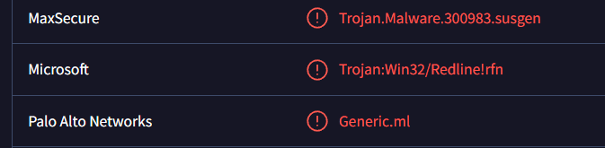
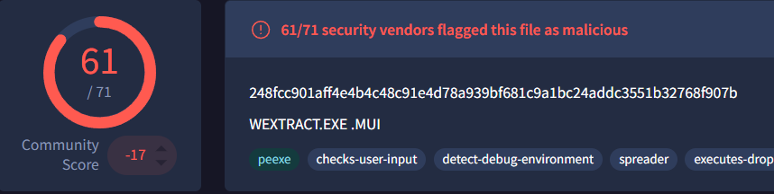
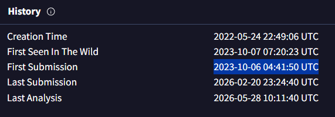
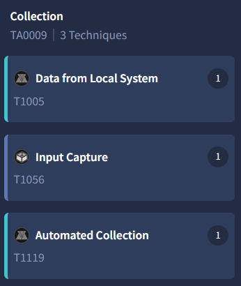
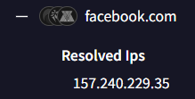
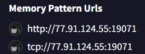
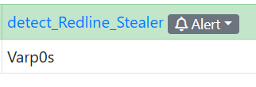
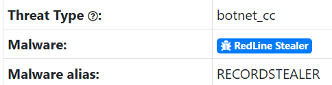
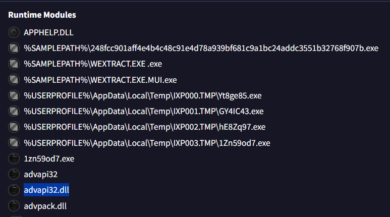

# # Red Stealer Lab

| Propiedad             | Detalle                                                                           |
| :-------------------- | :-------------------------------------------------------------------------------- |
| **Plataforma**        | [CyberDefenders](https://cyberdefenders.org/blueteam-ctf-challenges/red-stealer/) |
| **Categoría**         | Threat Intel                                                                      |
| **Dificultad**        | Fácil                                                                             |
| **Estado**            | Completado                                                                        |
| **Proyecto Completo** | [matircode.dev](https://matircode.dev)                                            |

---

## 1. Resumen Ejecutivo
### Antecedentes e Inicialización 
La presente investigación de Inteligencia de Amenazas (Threat Intelligence) se inició tras el hallazgo de un archivo ejecutable sospechoso en la estación de trabajo de un colaborador de la organización. Los sistemas de monitoreo perimetral y las alertas tempranas del SOC sugirieron que el binario interactuaba de forma anómala con la red, presentando un comportamiento característico de balizamiento (beaconing) hacia una infraestructura externa de Comando y Control (C2). Ante el riesgo latente de una infección activa por malware de tipo *Stealer* y la potencial exfiltración de credenciales corporativas, se procedió al aislamiento del artefacto para su análisis exhaustivo.
### Alcance de la Investigación
El análisis técnico se centra en la evaluación del hash de la muestra maliciosa y su posterior pivoteo en fuentes de acceso público (OSINT) y plataformas especializadas de Threat Intel, persiguiendo los siguientes objetivos operativos: 
1. **Identificación del Artefacto:** Determinar la firma criptográfica, tipo de empaquetado y la familia exacta del malware. 
2. **Mapeo de TTPs:** Identificar las técnicas de ejecución, persistencia, evasión de defensas y los mecanismos de escalada de privilegios implementados por el código. 
3. **Análisis de Infraestructura:** Descubrir y caracterizar la red del atacante (servidores C2, dominios y direcciones IP activas). 
4. **Generación de Inteligencia Accionable:** Extraer Indicadores de Compromiso (IoCs) estructurados para alimentar las reglas de detección del SOC y agilizar los esfuerzos de mitigación del equipo de Respuesta a Incidentes (IR).

## 2. Mapeo de Amenazas (MITRE ATT&CK Framework)
Correlación formal de las Tácticas, Técnicas y Procedimientos (TTPs) identificadas durante la investigación con el marco de trabajo de MITRE ATT&CK.

### Táctica: Evasión de Defensas (TA0005)
*   **Técnica:** Obfuscated Files or Information: Software Packing (T1027.002)
*   **Análisis Técnico:** El análisis estático de las cabeceras del ejecutable (`248fcc901aff4e4b4c48c91e4d78a939bf681c9a1bc24addc3551b32768f907b`) reveló que el parámetro *Original Filename* está registrado como `WEXTRACT.EXE`. Esto confirma que el malware no es un binario plano, sino un paquete autoextraíble (SFX) compilado mediante la herramienta nativa de Windows **IExpress**. El atacante abusa de este empaquetador legítimo para consolidar el payload del *Stealer* y sus scripts de despliegue en un solo archivo, dificultando la detección estática basada en firmas y forzando al analista a realizar un desempaquetado (unpacking) o análisis dinámico para extraer el código malicioso real.

### Táctica: Recolección (TA0009)
*   **Técnica:** Data from Local System (T1005)
*   **Análisis Técnico:** El artefacto bajo análisis ejecuta rutinas automatizadas de enumeración y extracción de datos confidenciales directamente desde el sistema de archivos del host comprometido. Esta actividad de recolección se enfoca en el escaneo de directorios críticos de aplicaciones, bases de datos locales de credenciales de navegadores basados en Chromium (archivos de contraseñas, sesiones de autocompletado y *cookies* en formato SQLite), datos de carteras de criptomonedas y extensiones específicas de archivos de texto en el escritorio del usuario. El malware centraliza y procesa estos vectores de datos localmente (habitualmente en subdirectorios ocultos de `%TEMP%`) preparándolos como una carga consolidada antes de iniciar la fase de exfiltración.
---

## 3. Indicadores de Compromiso (IoCs) Encontrados
Datos tácticos extraídos del análisis que sirven para alimentar las reglas de detección en sistemas defensivos como Firewalls, EDR o SIEM.

### Indicadores de Red (Network Artifacts)
* **Dominios Consultados (DNS):** `facebook.com`
* **Propósito Identificado:** Verificación de conectividad WAN / Evasión de Sandbox.
* **Dirección IP de C2:** `77.91.124.55`
* **Puerto de Destino:** `19071/TCP` 
* **Socket Completo (C2):** `77.91.124.55:19071`

### Indicadores de Host (Host Artifacts)
* **Hash SHA-256:** `248fcc901aff4e4b4c48c91e4d78a939bf681c9a1bc24addc3551b32768f907b` 
* **Clasificación del Motor (Microsoft):** `trojan`

### Reglas de Detección (YARA / Firmas) 
* **Regla YARA (MalwareBazaar):** `detect_Redline_Stealer`
* **Autor de la Regla:** Varp0s 
* **Familia de Malware Identificada:** RedLine Stealer

---

## 4. Resolución del Desafío (CyberDefenders Q&A)
Sección técnica destinada a la resolución y validación de los requerimientos específicos del laboratorio, detallando el procedimiento analítico y la respectiva evidencia gráfica.

### Pregunta 1: Categorizing malware enables a quicker and clearer understanding of its unique behaviors and attack vectors. What category has Microsoft identified for that malware in VirusTotal?

*   **Respuesta:** `trojan`
*   **Metodología de Análisis:** Para iniciar el triaje técnico de la muestra ejecutable recuperada de la estación de trabajo del colaborador, se procedió a calcular sus firmas criptográficas (hashes) dentro del entorno aislado de **FlareVM**. Una vez obtenido el identificador único del archivo, se realizó una consulta de reputación global en la plataforma **VirusTotal** para evaluar el consenso de la industria y agilizar la clasificación de la amenaza.

    Al inspeccionar la sección de veredictos en la pestaña **Detection**, se analizó la telemetría específica proporcionada por el motor de **Microsoft**. El proveedor clasifica formalmente el binario bajo la categoría de **`trojan`** (troyano). Taxonómicamente, esto confirma que el artefacto carece de capacidades de autoreplicación (a diferencia de un gusano), y que depende de técnicas de ingeniería social o enmascaramiento como software legítimo para lograr la ejecución inicial por parte del usuario, sirviendo habitualmente como vector de entrada para cargas maliciosas de tipo *Stealer* o persistencias C2.
  
    
  
  
### Pregunta 2: Clearly identifying the name of the malware file improves communication among the SOC team. What is the file name associated with this malware?

*   **Respuesta:** `wextract`
*   **Metodología de Análisis:** Tras validar la clasificación de la muestra, se procedió a auditar los metadatos estáticos del ejecutable (Portable Executable) dentro de la pestaña **Details** y el campo **Names** de VirusTotal. 

    La telemetría indica que el binario fue estructurado originalmente bajo el nombre interno **`WEXTRACT.EXE`**, el cual corresponde a una herramienta legítima de Microsoft Windows (*Win32 Cabinet Self-Extractor* / IExpress Wizard). El análisis forense confirma que el adversario utilizó la técnica de **Masquerading (T1036)**, manipulando los recursos del empaquetador legítimo para ocultar y distribuir una carga maliciosa activa (identificada en fuentes de Threat Intel como una variante de *RedLine Stealer / SmokeLoader*). Este comportamiento busca engañar tanto al usuario final como a las detecciones heurísticas del SOC basadas en nombres de procesos sospechosos.

    *(Nota: Conforme a las restricciones de sintaxis de la plataforma, se descarta la extensión `.exe` en el registro final de la flag).*
  
    

### Pregunta 3: Knowing the exact timestamp of when the malware was first observed can help prioritize response actions. Newly detected malware may require urgent containment and eradication compared to older, well-documented threats. What is the UTC timestamp of the malware's first submission to VirusTotal?

*   **Respuesta:** `2023-10-06 04:41
*   **Metodología de Análisis:** Para establecer la ventana temporal de la campaña y determinar el nivel de madurez de la amenaza, se examinaron las marcas de tiempo históricas (*History*) dentro de la sección de detalles técnicos de **VirusTotal** para el hash `248fcc901aff4e4b4c48c91e4d78a939bf681c9a1bc24addc3551b32768f907b`. 

    El registro identifica cronológicamente la primera sumisión global (*First Submission*) el **`2023-10-06 04:41:50 UTC`**. Desde una perspectiva de DFIR y Threat Intelligence, documentar este artefacto temporal es crítico por dos razones operativas:
    1.  **Definición del Periodo de Lookback:** Permite al equipo de Threat Hunting acotar las búsquedas retrospectivas en el SIEM. Al saber cuándo apareció la muestra en el ecosistema digital, se prioriza la auditoría de telemetría de red y endpoints desde esa fecha hacia adelante.
    2.  **Evaluación del Vector de Campaña:** Al contrastar esta fecha con la detección interna en nuestra infraestructura, el SOC puede determinar si la organización se enfrentó a una variante de distribución masiva (commodity malware) ya indexada, o a un despliegue temprano potencialmente asociado a una campaña dirigida de spear-phishing.
  
    

### Pregunta 4: Understanding the techniques used by malware helps in strategic security planning. What is the MITRE ATT&CK technique ID for the malware's data collection from the system before exfiltration?

*   **Respuesta:** `T1005`
*   **Metodología de Análisis:** Para alinear las capacidades operativas del malware con el marco táctico defensivo, se analizó el comportamiento del ejecutable en la matriz de **MITRE ATT&CK Mapping** integrada en **VirusTotal**.

    Los indicadores mecánicos demuestran que, previo a la inicialización de los hilos de red o de comunicación saliente, el binario realiza operaciones masivas de lectura sobre el almacenamiento interno de la máquina. En la taxonomía de MITRE ATT&CK, el procedimiento mediante el cual un troyano accede, indexa y recolecta información directamente del almacenamiento local del host víctima se clasifica formalmente bajo la táctica de **Collection (TA0009)** con el identificador de técnica **`T1005`** (*Data from Local System*). Registrar esta técnica en el reporte es crucial para el equipo de Blue Team, ya que justifica la implementación de políticas restrictivas de control de acceso a archivos y la activación de telemetría de auditoría sobre lecturas anómalas de perfiles de usuario.
  
    

### Pregunta 5: Following execution, which social media-related domain names did the malware resolve via DNS queries?

* **Respuesta:** `facebook.com`
* **Metodología de Análisis:** Con el fin de examinar el comportamiento interactivo del troyano tras su ejecución, se auditó la pestaña **Behavior** (Comportamiento) en **VirusTotal**, analizando específicamente los reportes de las sandboxes dinámicas y el apartado de solicitudes de resolución de nombres de dominio (**DNS Queries**).

    La telemetría de red revela que el proceso realiza una solicitud de resolución explícita para el dominio **`facebook.com`**. Desde la perspectiva de ingeniería inversa y DFIR, este comportamiento de consultar un dominio de red social legítimo y de alta reputación responde habitualmente a dos TTPs de evasión y control:
    1.  **Verificación de Conectividad Activa (Internet Check):** El malware valida si el host comprometido tiene salida real a Internet antes de desplegar sus hilos de red principales o descargar cargas secundarias.
    2.  **Evasión de entornos aislados (Sandbox Evasion):** Muchas sandboxes automatizadas de análisis de malware operan sin enrutamiento externo real o simulan respuestas falsas. Si el malware detecta que un dominio masivo como Facebook no resuelve correctamente o devuelve anomalías, asume que está bajo inspección y aborta su ejecución para evitar ser detectado.
  
    

### Pregunta 6: Once the malicious IP addresses are identified, network security devices such as firewalls can be configured to block traffic to and from these addresses. Can you provide the IP address and destination port the malware communicates with?

* **Respuesta:** `77.91.124.55:19071`
* **Metodología de Análisis:** Para identificar la infraestructura de Comando y Control (C2) activa empleada por el troyano para centralizar el control y recibir los datos recolectados, se auditó la sección de comunicaciones de red dentro de las pestañas **Relations** y **Behavior** en **VirusTotal**.

    Los registros del tráfico de red (Network Communications) evidencian que, tras completar las rutinas de evasión de sandbox y recolección de datos del sistema, el proceso malicioso inicia un apretón de manos TCP directo hacia el socket **`77.91.124.55:19071`**. 
    
    Desde la perspectiva de DFIR, este hallazgo es de criticidad alta debido a dos factores:
    1.  **Puerto No Estándar:** El uso del puerto `19071/TCP` (en lugar de puertos web convencionales como el 80 o 443) confirma que el malware utiliza un protocolo de comunicación binario propio para evadir los proxies web e inspecciones HTTP estándar de la capa de aplicación. Este comportamiento es una firma altamente característica de los paneles de administración de **RedLine Stealer**.
    2.  **Atribución de Infraestructura:** El pivoteo IP/ASN asocia este nodo a rangos de hosting de alto riesgo comúnmente abusados para el despliegue de infraestructuras criminales. Este indicador socket se entrega de inmediato al equipo de seguridad perimetral para generar un bloqueo de red bidireccional y mitigar cualquier fuga activa de información.
  
    

### Pregunta 7: YARA rules are designed to identify specific malware patterns and behaviors. Using MalwareBazaar, what's the name of the YARA rule created by "Varp0s" that detects the identified malware?

* **Respuesta:** `detect_Redline_Stealer`
* **Metodología de Análisis:** Para validar y corroborar la firma interna de la muestra mediante herramientas de coincidencia de patrones avanzadas, se introdujo el hash SHA-256 (`248fcc901aff4e4b4c48c91e4d78a939bf681c9a1bc24addc3551b32768f907b`) en el repositorio centralizado de malware **MalwareBazaar**. 

    Al inspeccionar la ficha técnica del archivo y desplazarse hacia la sección dedicada a las firmas y heurísticas comunitarias (**YARA Rules**), se filtraron las reglas asociadas por el campo de autoría. El registro expone que el investigador de amenazas **Varp0s** cargó y vinculó una regla de detección específica para este binario, denominada formalmente **`detect_Redline_Stealer`**.
    
    Este hallazgo en MalwareBazaar es definitivo para la investigación, ya que:
    1. **Atribución Absoluta:** Confirma de manera inequívoca que la muestra pertenece a la familia **RedLine Stealer**, un malware especializado en la recolección masiva de información confidencial (infostealer).
    2. **Despliegue Operativo:** La regla YARA puede ser extraída directamente e integrada en las herramientas de escaneo del host (como agentes EDR locales, Thor Scanner o scripts automatizados en CSI Linux) para realizar un barrido profundo en la memoria y los discos de toda la infraestructura corporativa en busca de hilos activos de esta misma campaña.
  
    

### Pregunta 8: Understanding which malware families are targeting the organization helps in strategic security planning for the future and prioritizing resources based on the threat. Can you provide the different malware alias associated with the malicious IP address according to ThreatFox?

* **Respuesta:** `RECORDSTEALER`
* **Metodología de Análisis:** Con el objetivo de profundizar en el perfil operativo y la taxonomía de la infraestructura de Comando y Control (C2) aislada (`77.91.124.55`), se procedió a realizar una consulta avanzada de correlación de amenazas en la plataforma **ThreatFox** (desplegada por Abuse.ch) desde el entorno de análisis **CSI Linux**.

    Al interrogar el registro histórico y los conjuntos de datos de telemetría asociados a dicha dirección IP, se inspeccionó el campo de alias e identificadores comunitarios de malware (*malware tagnames*). La plataforma asocia formalmente este nodo de red con el alias **`RECORDSTEALER`**. 

    Estructural y mecánicamente, *RecordStealer* constituye una denominación alternativa o variante directa utilizada por diversas firmas de ciberseguridad para catalogar las campañas comerciales de **RedLine Stealer**. Registrar este alias dentro del repositorio de Obsidian es fundamental para el equipo de caza de amenazas (Threat Hunting), ya que garantiza que las búsquedas retrospectivas en el SIEM y las firmas de endpoints contemplen todas las variantes nomenclatúricas de la industria, neutralizando posibles brechas de visibilidad defensiva.
  
    

### Pregunta 9: By identifying the malware's imported DLLs, we can configure security tools to monitor for the loading or unusual usage of these specific DLLs. Can you provide the DLL utilized by the malware for privilege escalation?

* **Respuesta:** `advapi32.dll`
* **Metodología de Análisis:** Para identificar los mecanismos de interacción de bajo nivel que utiliza el troyano con el sistema operativo Windows, se inspeccionó la tabla de importaciones (**Imports**) dentro de la pestaña **Behavior** de **VirusTotal**.

    El análisis estático del encabezado del ejecutable portátil (PE) revela la carga explícita de la librería dinámica **`advapi32.dll`** (Advanced API library). 
    
    Desde la perspectiva de DFIR y el análisis de malware, la identificación de esta DLL específica confirma capacidades avanzadas sobre el subsistema de seguridad de Windows:
    1. **Manipulación de Tokens de Acceso:** `advapi32.dll` exporta funciones nativas críticas como `OpenProcessToken`, `AdjustTokenPrivileges` y `LookupPrivilegeValueW`. El malware abusa de estas APIs para consultar los privilegios del hilo actual y habilitar explícitamente tokens de alta integridad (como `SeDebugPrivilege` o `SeTakeOwnershipPrivilege`).
    2. **Mapeo de TTP (Escalada de Privilegios):** Este comportamiento se alinea con la técnica **Access Token Manipulation (T1134)** de MITRE ATT&CK. Al elevar sus privilegios de ejecución, el proceso del *Stealer* garantiza los accesos necesarios para evadir controles locales de usuario (UAC Bypass), inyectarse en procesos protegidos del sistema o acceder a áreas restringidas de la memoria donde residen credenciales en texto plano.
  
    